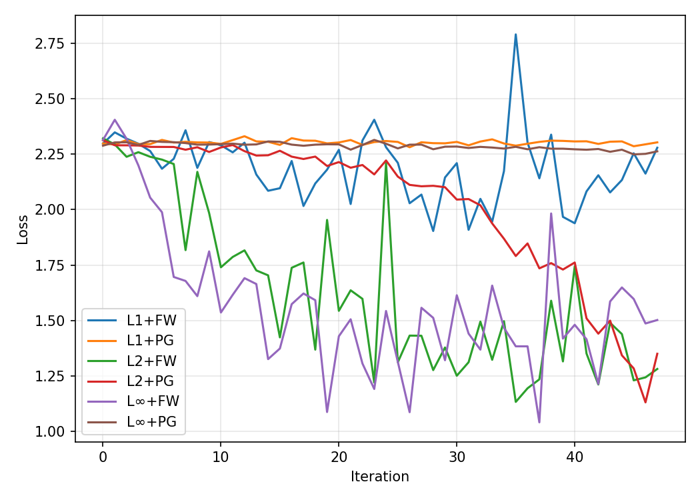

# ⚙️ Фреймворк ограниченной оптимизации для PyTorch

Мини-фреймворк для обучения нейронных сетей с ограничениями на параметры.

## 🎯 Особенности

* **Гибкая модульная архитектура:** легко комбинировать модели, множества и оптимизаторы
* **Реализованы методы:** Frank–Wolfe и Projected Gradient
* **Поддержка множеств:** L₁, L₂ и L∞-нормы
* **Совместимость:** работает с любыми `torch.nn.Module`
* **Визуализация:** сравнение сходимости и проверка ограничений

---

## 🧩 Структура проекта

```
constraint_optimization/
├── example_all_constraints.py   # Главный скрипт эксперимента
├── models/
│   └── small_cnn.py             # Простая CNN для MNIST
├── sets/
│   ├── base.py                  # Абстрактный базовый класс ConstraintSet
│   ├── l1_constraint.py         # Ограничение по L1-норме
│   ├── l2_constraint.py         # Ограничение по L2-норме
│   └── linf_constraint.py       # Ограничение по L∞-норме
└── optim/
    ├── frank_wolfe.py           # Оптимизатор Frank–Wolfe
    └── projected_grad.py        # Оптимизатор Projected Gradient
```

---

## 🚀 Запуск эксперимента

### 1. Установка зависимостей

```bash
pip install torch torchvision matplotlib
```

### 2. Запуск сравнения всех методов

```bash
python constraint_optimization/example_all_constraints.py
```

Скрипт:

1. Загружает датасет MNIST (1000 примеров)
2. Обучает CNN с 6 комбинациями (FW/PG × L₁/L₂/L∞)
3. Строит график убывания лосса
4. Проверяет выполнение ограничений
5. Сохраняет график в `comparison.png` (в корне репозитория)

---

## 📊 Результаты эксперимента

Ниже показан график убывания функции потерь для разных комбинаций методов и множеств:

<p align="center">
  
</p>

На графике сравнивается скорость сходимости для:

* **L₁ + FW**, **L₂ + FW**, **L∞ + FW**
* **L₁ + PG**, **L₂ + PG**, **L∞ + PG**

✅ Методы Projected Gradient гарантируют строгое соблюдение ограничений.
⚙️ Frank–Wolfe может выходить за границу множества из-за линейного шага, но остаётся близким к ней.

---

## 📈 Теоретическая и практическая сходимость

### 🔹 Projected Gradient Descent (PGD)

$$
x_{t+1} = \Pi_{\mathcal{C}}(x_t - \eta_t \nabla f(x_t))
$$

**Сходимость:**

- Для выпуклой и L-гладкой функции f:

$$
f(x_t) - f^\star = \mathcal{O}\!\left(\frac{1}{t}\right)
$$

- Для µ-сильно выпуклой f:

$$
f(x_t) - f^\star = \mathcal{O}\!\left((1 - \mu/L)^t\right)
$$

---

### 🔹 Frank–Wolfe (FW)

$$
s_t = \arg\min_{s \in \mathcal{C}} \langle \nabla f(x_t), s \rangle, 
\qquad
x_{t+1} = (1 - \gamma_t)x_t + \gamma_t s_t
$$

**Сходимость:**

- Для выпуклой f:

$$
f(x_t) - f^\star = \mathcal{O}\!\left(\frac{1}{t}\right)
$$

- Для сильно выпуклой f и строго выпуклого множества \mathcal{C}:

$$
f(x_t) - f^\star = \mathcal{O}\!\left(\frac{1}{t^2}\right)
$$


---

| Свойство         | Projected Gradient              | Frank–Wolfe                       |
| ---------------- | ------------------------------- | --------------------------------- |
| Требует проекции | ✅                               | ❌                                 |
| Стоимость шага   | высокая                         | низкая                            |
| Сходимость       | \(\mathcal{O}(1/t)\) или линейная | \(\mathcal{O}(1/t)\)              |
| Решения          | плотные                         | разреженные                       |
| На практике      | устойчивая сходимость           | мягкое поведение, но менее точное |

---

## 💡 Использование с собственной моделью

```python
from constraint_optimization.models import SmallCNN
from constraint_optimization.sets import L1ConstraintSet
from constraint_optimization.optim import FrankWolfe

model = SmallCNN()
tau = {name: 5.0 for name, _ in model.named_parameters()}
constraint = L1ConstraintSet(model, tau)

optimizer = FrankWolfe(
    [{"params": model.parameters(),
      "params_dict": dict(model.named_parameters())}],
    constraint, lr=0.05
)
```

---

## 🔧 Расширение

Добавление нового множества:

```python
class L2ConstraintSet(ConstraintSet):
    def lmo(self, grad_dict):
        ...
    def project(self, param_dict):
        ...
```

Добавление нового оптимизатора:

```python
class MyOptimizer(torch.optim.Optimizer):
    def step(self, closure):
        ...
```

---

## 📚 Литература

* Jaggi, M. (2013). *Revisiting Frank-Wolfe: Projection-Free Sparse Convex Optimization*
* Lacoste-Julien, S. (2016). *Convergence rate of Frank-Wolfe for non-convex objectives*
* Beck, A. (2017). *First-Order Methods in Optimization*
* Bertsekas, D. (1999). *Nonlinear Programming*

