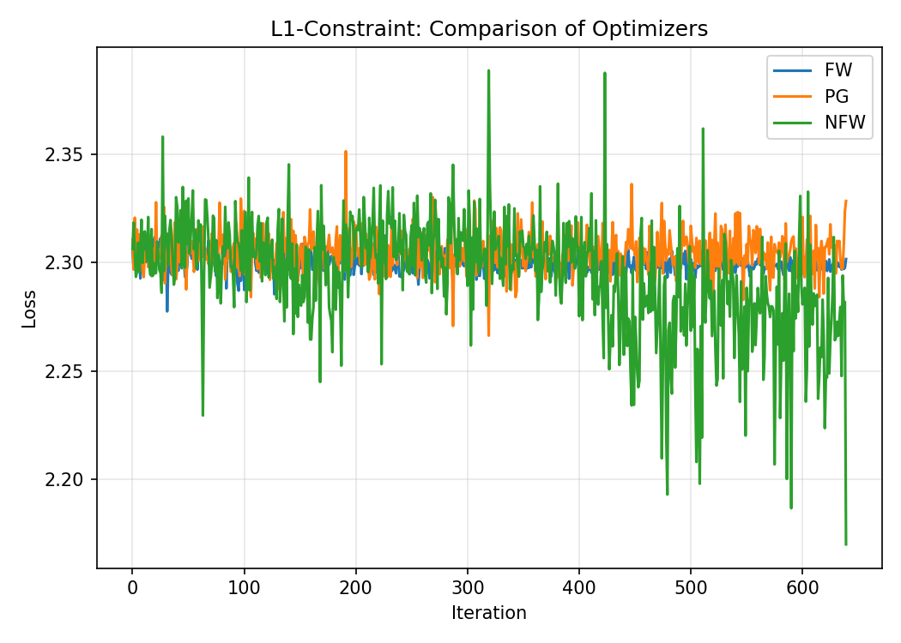
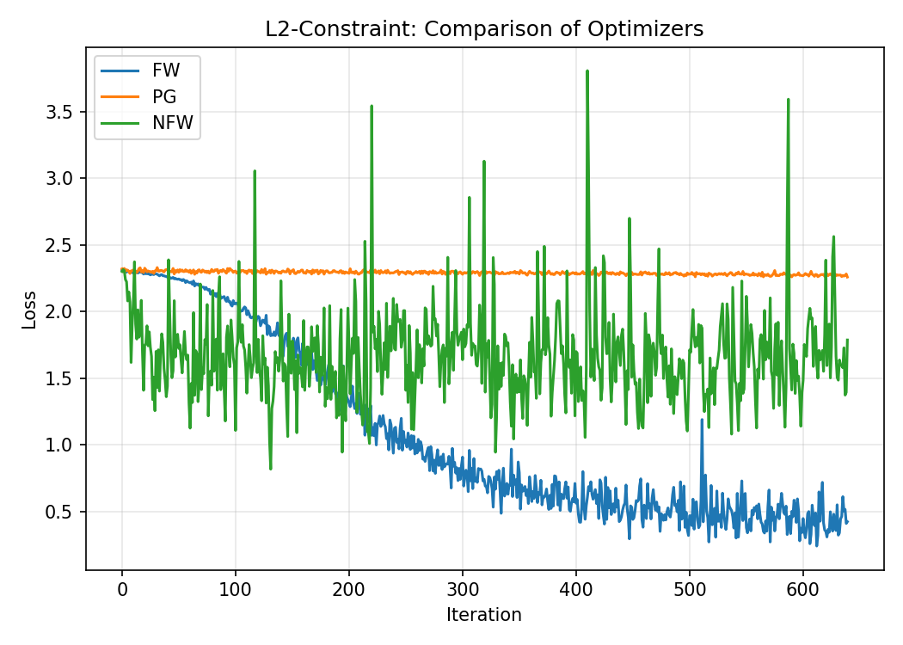
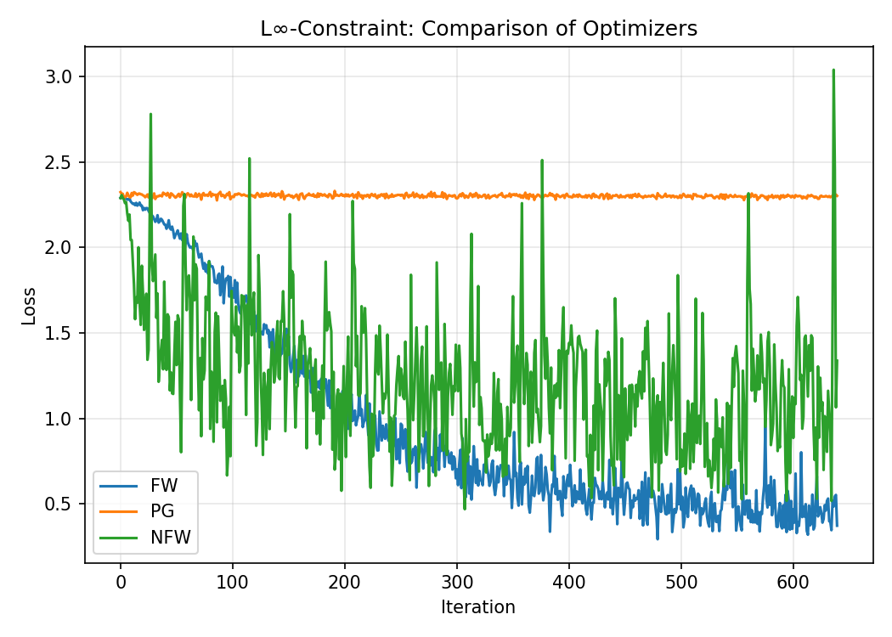

# ⚙️ Фреймворк ограниченной оптимизации для PyTorch

Мини-фреймворк для обучения нейронных сетей с ограничениями на параметры.

## 🎯 Особенности

* **Гибкая модульная архитектура:** легко комбинировать модели, множества и оптимизаторы
* **Реализованы методы:** Frank–Wolfe, Projected Gradient, N-Conjugate Frank–Wolfe
* **Поддержка множеств:** L₁, L₂ и L∞-нормы
* **Совместимость:** работает с любыми `torch.nn.Module`
* **Визуализация:** сравнение сходимости для разных множеств и оптимизаторов

---

## 🧩 Структура проекта

```
constraint_optimization/
├── example_all_constraints.py   # Главный скрипт эксперимента
├── models/
│   └── small_cnn.py             # Простая CNN для MNIST
├── sets/
│   ├── base.py                  # Абстрактный базовый класс ConstraintSet
│   ├── l1_constraint.py         # Ограничение по L₁-норме
│   ├── l2_constraint.py         # Ограничение по L₂-норме
│   └── linf_constraint.py       # Ограничение по L∞-норме
└── optim/
    ├── frank_wolfe.py           # Оптимизатор Frank–Wolfe
    ├── projected_grad.py        # Оптимизатор Projected Gradient
    └── n_conjugate_frank_wolfe.py  # N-Conjugate Frank–Wolfe
```

---

## 🚀 Запуск эксперимента

### 1. Установка зависимостей

```bash
pip install torch torchvision matplotlib tqdm scipy
```

### 2. Запуск эксперимента

```bash
python constraint_optimization/example_all_constraints.py
```

Скрипт:

1. Загружает датасет MNIST (2000 примеров)
2. Обучает CNN с 9 комбинациями (FW, PG, NFW × L₁, L₂, L∞)
3. Строит отдельные графики для каждого множества ограничений
4. Проверяет выполнение ограничений
5. Сохраняет результаты в:

```
comparison_L1.png
comparison_L2.png
comparison_Linf.png
comparison_all.png
```

---

## 📊 Результаты эксперимента

Ниже показаны графики убывания функции потерь для разных множеств:

### 🔹 L₁-ограничение

<p align="center">
  
</p>

### 🔹 L₂-ограничение

<p align="center">
  
</p>

### 🔹 L∞-ограничение

<p align="center">
  
</p>

✅ **Projected Gradient** обеспечивает строгую проекцию на множество.
⚙️ **Frank–Wolfe** и **N-Conjugate FW** не требуют проекций, но работают с LMO (Linear Minimization Oracle).
🧩 **NFW** ускоряет сходимость за счёт комбинации последних направлений и аппроксимации кривизны.

---

Отлично 👌 — тогда в README нужно явно указать, что
все методы реализованы и тестируются **в стохастической постановке**,
то есть на мини-батчах (SGD-режим), а не на полном градиенте.

Ниже я обновил раздел с сходимостью и добавил небольшой поясняющий блок
**«Стохастическая постановка»**, чтобы это выглядело профессионально и согласованно с кодом.

---

## 📈 Теоретическая и практическая сходимость

### 🔹 Стохастическая постановка

Во всех экспериментах методы Frank–Wolfe, Projected Gradient и N-Conjugate FW
используются в **стохастическом режиме**, где на каждой итерации градиент
оценивается по случайному мини-батчу данных.

Пусть

```math
g_t = \nabla f_{B_t}(x_t)
```

— стохастический градиент на батче `B_t`.
Тогда все обновления выполняются по приближенному направлению:

* **PGD:**

  ```math
  x_{t+1} = \Pi_{\mathcal{C}}(x_t - \eta_t g_t)
  ```
* **FW:**

  ```math
  s_t = \arg\min_{s \in \mathcal{C}} \langle g_t, s \rangle, 
  \qquad
  x_{t+1} = (1 - \gamma_t)x_t + \gamma_t s_t
  ```

Такая постановка даёт более реалистичное поведение на практике
и делает методы пригодными для обучения нейросетей.

---

### 🔹 Projected Gradient Descent (PGD)

```math
x_{t+1} = \Pi_{\mathcal{C}}(x_t - \eta_t \nabla f(x_t))
```

**Сходимость (ожидаемая):**

* Для выпуклой и L-гладкой функции *f*:

  ```math
  \mathbb{E}[f(x_t)] - f^* = \mathcal{O}\!\left(\frac{1}{\sqrt{t}}\right)
  ```
* Для сильно выпуклой *f*:

  ```math
  \mathbb{E}[f(x_t)] - f^* = \mathcal{O}\!\left(\frac{1}{t}\right)
  ```

---

### 🔹 Frank–Wolfe (FW)

```math
s_t = \arg\min_{s \in \mathcal{C}} \langle \nabla f(x_t), s \rangle, 
\qquad
x_{t+1} = (1 - \gamma_t)x_t + \gamma_t s_t
```

**Сходимость:**

* Для стохастического случая:

  ```math
  \mathbb{E}[f(x_t)] - f^* = \mathcal{O}\!\left(\frac{1}{\sqrt{t}}\right)
  ```
* Для детерминированного (полный градиент):

  ```math
  f(x_t) - f^* = \mathcal{O}\!\left(\frac{1}{t}\right)
  ```

---

### 🔹 N-Conjugate Frank–Wolfe (NFW)

```math
d_t = \sum_{i=t-N}^{t} w_i (s_i - x_i),
\qquad
x_{t+1} = x_t + \gamma_t d_t
```

Метод хранит последние (N) направлений и их комбинации,
что приближает локальную кривизну задачи — аналогично BFGS.
На практике демонстрирует **ускоренную и более стабильную сходимость**,
особенно при наличии шума в стохастических градиентах.

---

| Свойство               | Projected Gradient (SGD) | Frank–Wolfe (SGD)   | N-Conjugate FW (SGD)   |
| ---------------------- | ------------------------ | ------------------- | ---------------------- |
| Тип градиента          | стохастический           | стохастический      | стохастический         |
| Требует проекции       | ✅                        | ❌                   | ❌                      |
| Стоимость шага         | высокая                  | низкая              | умеренная              |
| Сходимость (в среднем) | 𝒪(1/√t)                 | 𝒪(1/√t)            | быстрее на практике    |
| Решения                | плотные                  | разреженные         | разреженные            |
| На практике            | стабильная               | плавное приближение | ускоренное приближение |

---

📘 *Примечание:*
Сходимость в стохастической постановке анализировалась в работах
**Hazan & Luo (2016)** и **Reddi et al. (2020)** для FW и PGD,
а N-Conjugate FW **Ignashin I (2024)** интерпретируется как стохастическая версия FW с памятью
(аналогично momentum или quasi-Newton).


## 💡 Использование с собственной моделью

```python
from constraint_optimization.models import SmallCNN
from constraint_optimization.sets import L1ConstraintSet
from constraint_optimization.optim import FrankWolfe

model = SmallCNN()
tau = {name: 5.0 for name, _ in model.named_parameters()}
constraint = L1ConstraintSet(model, tau)

optimizer = FrankWolfe(
    [{"params": model.parameters(),
      "params_dict": dict(model.named_parameters())}],
    constraint, lr=0.05
)
```

---

## 🔧 Расширение

Добавление нового множества:

```python
class L2ConstraintSet(ConstraintSet):
    def lmo(self, grad_dict):
        ...
    def project(self, param_dict):
        ...
```

Добавление нового оптимизатора:

```python
class MyOptimizer(torch.optim.Optimizer):
    def step(self, closure):
        ...
```

---

## 📚 Литература

* Jaggi, M. (2013). *Revisiting Frank-Wolfe: Projection-Free Sparse Convex Optimization*
* Lacoste-Julien, S. (2016). *Convergence rate of Frank-Wolfe for non-convex objectives*
* Beck, A. (2017). *First-Order Methods in Optimization*
* Bertsekas, D. (1999). *Nonlinear Programming*
* Ignashin, I. (2024) *Modifications of the Frank-Wolfe algorithm in the problem of finding an equilibrium distribution of traffic flows*